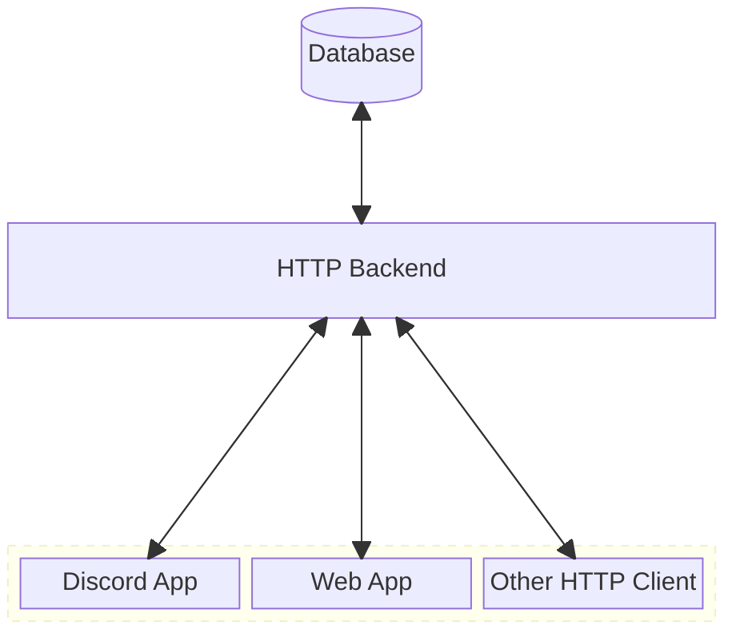

This document describes some of the major internal components of Grindcord and their functionality. A short summary of its overall high level structure is provided, as well as a description of each component.

Grindcord is a highly decoupled application consisting of a Discord Bot frontend, an HTTP backend, and a database.

###### Block diagram for Grindcord.

## User Interfaces (Discord App, Website)

To communicate with Discord, Grindcord uses the [Gateway API](https://discord.com/developers/docs/reference#gateway-websocket-api) provided by Discord.
Grindcord receives events and commands from the Discord interface.

Grindcord MUST be installed to a Discord server to function properly.

For a more fluid user experience, a web interface implements all features of the Discord Interface and MAY be used for read-only operations (pending).

## HTTP Backend and Database

For compatibility and extensibility, Grindcord provides a stateless backend which interfaces primarily with the User Interfaces detailed above, but can interact with any HTTP client.

Multiple backends MAY utilize the same database.
